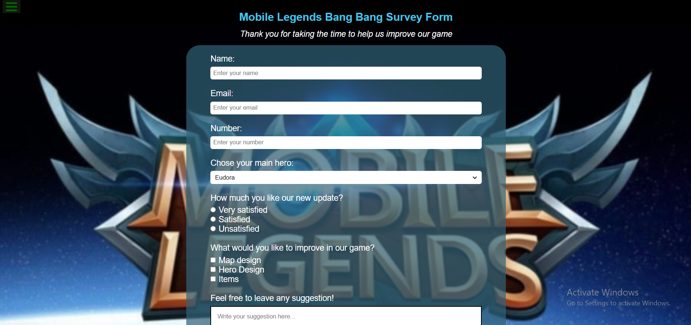

# Build a Survey Form

This is a solution to the [Build a Survey Form](https://survey-form-mobile-legends.netlify.app/).
FreeCodeCamp projects help you improve your coding skills by building realistic projects.

## Table of contents

- [Overview](#overview)
  - [Screenshot](#screenshot)
  - [Links](#links)
- [My process](#my-process)
  - [Built with](#built-with)
  - [What I learned](#what-i-learned)
  - [Continued development](#continued-development)
- [Author](#author)

## Overview

Focus is on making form, diffrent labels,patterns and required inputs.

### Screenshot



### Links

- Solution URL: [https://github.com/Holllyyyy/surveyform](https://github.com/Holllyyyy/surveyform)
- Live Site URL: [https://survey-form-mobile-legends.netlify.app/](https://survey-form-mobile-legends.netlify.app/)

## My process

I started with writing HTML where I added the form element and form's fields.
After it I moved on my style. I make css folder, and wrote CSS3.
I started with this:

```html
<!--I created form, than label and input-->
<form id="survey-form">
  <label for="name" id="name-label">Name:</label>
  <input
    type="text"
    id="name"
    name="text"
    pattern="[A-Za-z]"
    placeholder="Enter your name"
    title="Must be letters"
    required
  /><br />
  <label for="email" id="email-label">Email:</label>
  <input
    type="email"
    id="email"
    name="email"
    pattern="[a-z0-9._%+-]+@[a-z0-9.-]+\.[a-z]{2,}$"
    placeholder="Enter your email"
    required
  /><br />
  <label for="number" id="number-label">Number:</label>
  <input
    type="number"
    id="number"
    name="number"
    min="9"
    max="15"
    placeholder="Enter your number"
    title="Must be number"
    required
  /><br />
  <!-- With pattern I am chosing what user will write and how long, placeholder, will be presented to users, required is meaning of something what must be filled --->
  <label for="heros" id="heros">Chose your main hero:</label>
  <select name="hero" id="dropdown">
    <option value="eudora">Eudora</option>
    <option value="layla">Layla</option>
    <option value="atlas">Atlas</option>
    <option value="granger">Granger</option>
    </select>
    <!--This is example of dropdown menu, with use of select , so user can select what it likes-->

    <div id="update">
      <p>How much you like our new update?</p>
      <input type="radio" name="newupdate" value="Very satisfied" />
      <label for="verysatisfied">Very satisfied</label><br />
      <input type="radio" name="newupdate" value="Satisfied" />
      <label for="satisfied">Satisfied</label><br />
      <input type="radio" name="newupdate" value="Unsatisfied" />
      <label for="unsatisfied">Unsatisfied</label>
    </div>
    <br /> <!--This is an example of radio-button use. Label here is very important, because without label user will need to focus only that radio button and like this he can click on the text as well and will be same result-->
         <div id="improve"><p>What would you like to improve in our game?</p>
        <input type="checkbox"  name="mapdesign" value="mapdesign">
        <label for="mapdesign">Map design</label><br>
        <input type="checkbox" name="herodesign" value="herodesign">
        <label for="herodesign">Hero Design</label><br>
        <input type="checkbox" name="items" value="items">
        <label for="items">Items</label></div><br>
        <!--This is an example of checkbox, same as with raio buttons  where I put label, here is also like it, user can check what he likes-->

          <label class="sug" for="sug">Feel free to leave any suggestion!</label>
        <textarea name="sug" id="sug" placeholder="Write your suggestion here..."></textarea>
        </textarea><br>
        <input type="submit" id="submit" value="Submit">
        <!--Here is textarea and place holder, placeholder living message to user, what is needed to write there, and text area is place where user will actually leave some text-->

```

```css
* {
  margin: 0;
  padding: 0;
  box-sizing: border-box;
  font-family: "Poppins", sans-serif;
} /*some basics */

body {
  display: flex;
  justify-content: center;
  flex-direction: column;
  align-items: center;
  padding: 1rem;
  margin: 1rem;
  min-height: 100vh;
  max-width: 100%;
  background: white;
  background-image: url("https://androidayuda.com/wp-content/uploads/2021/05/mobile-legends-1.jpg");
  background-repeat: no-repeat;
  background-position: center;
  background-size: cover;
} /*like this my content is centered,with background picture, without repating ,i put background-color in case if somewhere picture is not able to be opened.  */
h1 {
  text-align: center;
  font-size: 1, 25rem;
  margin-bottom: 1rem;
  margin-top: 1rem;
  color: rgb(72, 195, 233);
} /* its much better practice to put for my text rem , because at first I used px, and I had some issues*/
#description {
  text-align: center;
  font-style: italic;
  margin-top: 1%;
  margin-bottom: 1rem;
  color: #ffffff;
} /*here I just made space bottom top*/
```

### Built with

- Semantic HTML5 markup
- CSS custom properties

### What I learned

While working on this project I learned :

- How to make form
- How to make form accessible
- Inside the form element, any user will be required to enter an email,name,number in a field. If user does not enter an email,name,number he/she will see an HTML5 validation error.
- Radio-buttons
- Checkboxes
- Use of text-area
- For the name, email, and number input fields, I put placeholder text that gives the user a description or instructions for each field.
- For the name, email, and number input fields inside the form I put corresponding labels that describe the purpose of each field.
- To put background photo wiith opacity.

### Continued development

I will continue next with Build a Product Landing Page, from freeCodeCamp. I want to practice and improve my HTML5 and CSS3 skills.

## Author

- Website - [Svetlana Jokic](https://my-portfolio-hollyy.netlify.app/)
- Frontend Mentor - [@Holllyyyy](https://www.frontendmentor.io/profile/Holllyyyy)
- Twitter - [@svetlanajokic](https://twitter.com/svetlanajokic)
- LinkedIn - [@Svetlana Jokic](https://www.linkedin.com/in/svetlana-jokic-787432100/)
- FreeCodeCamp - [@hollyy](https://www.freecodecamp.org/hollyy)

